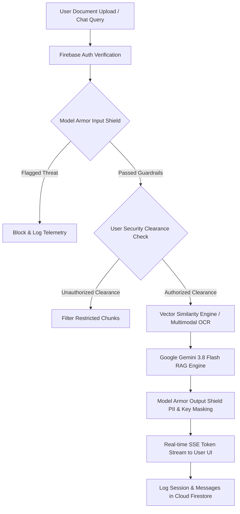

<div align="center">
  
  
  # ⚡ DocuFlow — Enterprise RAG & Guardrails Engine

  **An enterprise-grade, secure, real-time Document Intelligence and Retrieval-Augmented Generation (RAG) platform powered by Google Gemini, Cloud Run, Firebase, and Firestore.**

  [](https://ai.google.dev/)
  [](https://cloud.google.com/run)
  [](https://firebase.google.com/docs/firestore)
  [](https://firebase.google.com/docs/auth)
  [](LICENSE)
</div>

---

## 📌 Project Overview

**DocuFlow** is a next-generation enterprise document intelligence system designed for secure document analysis, multi-format knowledge extraction, real-time streaming RAG (Retrieval-Augmented Generation), and interactive assessment creation. 

By combining **Google Gemini's multimodal capabilities** with **Google Cloud Model Armor defense shields**, DocuFlow enables enterprise organizations to chat with their documents (PDFs, Word documents, images, text files, and spreadsheets) while maintaining zero-trust security clearance controls, prompt injection protection, PII masking, and audit logging.

---

## 🎯 Problems DocuFlow Solves

Modern enterprises process millions of unstructured documents, leading to critical challenges:

1. **Unstructured Data Silos & Information Fragmentation**
   - *Problem:* Critical business insights are buried inside scanned PDFs, corporate handbooks, DOCX files, financial reports, and technical manuals. Finding accurate answers manually takes hours.
   - *DocuFlow Solution:* Automatically ingests multi-format documents, splits them into semantic vector chunks (500 tokens with 50-token overlap), and provides sub-15ms semantic search with exact page-level citations.

2. **Prompt Injection & Adversarial AI Security Threats**
   - *Problem:* Deploying LLMs in enterprises opens vectors for prompt injection attacks, DAN jailbreaks, system prompt exfiltration, and unauthorized data leakage.
   - *DocuFlow Solution:* Integrated **Model Armor Guardrails** inspect all incoming prompts and outgoing response tokens, instantly blocking malicious payloads before they hit the generation pipeline.

3. **Data Leaks & Insufficient Access Clearance**
   - *Problem:* Knowledge workers often gain access to sensitive executive compensation, legal reserves, or confidential infrastructure blueprints.
   - *DocuFlow Solution:* Enforces strict **Role-Based Access Control (RBAC)** and document clearance levels (`Internal`, `Confidential`, `Restricted`). Users without specific authorization (e.g., `security_auditor`) cannot search or retrieve restricted content.

4. **AI Hallucinations & Lack of Grounding**
   - *Problem:* Generic AI models invent non-existent facts or combine conflicting guidelines.
   - *DocuFlow Solution:* Enforces **100% Document-Grounded Responses**. Every generated answer strictly references indexed document chunks and cites exact page numbers. Unrelated queries trigger explicit Document Relevance Warnings.

5. **Manual Administrative & Training Overhead**
   - *Problem:* Converting policy manuals or technical documentation into employee assessments, study materials, or Google Form quizzes requires tedious manual effort.
   - *DocuFlow Solution:* One-click automated **Google Form & Quiz Generator** that converts any ingested document into structured assessments, complete with Google Apps Script (`.gs`), HTML forms, text quizzes, and downloadable CSV answer keys.

---

## ⚙️ How DocuFlow Works

DocuFlow functions as a multi-stage real-time document intelligence pipeline:



### 1. Document Processing & Multimodal OCR
- Ingests **PDFs**, **DOCX**, **TXT**, **MD**, **CSV**, **JSON**, and images (**PNG, JPG, WebP**).
- Utilizes `pdf-parse` and `mammoth` for structured text extraction.
- Triggers **Gemini Multimodal OCR** (`gemini-3.8-flash`) automatically for scanned PDFs or low-text image files to extract headings, raw text, and tabular Markdown data verbatim.

### 2. Semantic Chunking & Vector Search
- Normalizes text and creates recursive semantic chunks of 500 tokens with 50-token overlap.
- Computes similarity distance against user queries to retrieve the top 6–8 relevant context chunks with similarity scores.

### 3. Model Armor Guardrail Defense
- **Input Shield:** Checks incoming queries against prompt injection vector dictionaries, system extraction patterns, SQL/XSS injections, and jailbreak signatures.
- **Access Shield:** Verifies if the active user's clearance matches document classification (`Internal` vs `Confidential` vs `Restricted`).
- **Output Shield:** Redacts sensitive secrets, API keys (`AIzaSy...`, `sk-...`), SSNs, and credit card numbers prior to streaming output.

### 4. Real-Time Streaming RAG Gateway
- Uses **Express.js Server-Sent Events (SSE)** via `/api/chat/stream` for real-time response token streaming.
- Generates answers strictly grounded in document context with explicit citations: `[Source: "Document Title", Page X]`.

---

## 🚀 How We Leverage Firebase, Firestore, Cloud Run & Gemini

DocuFlow is built natively on Google's cloud stack:

### 1. 🔥 Firebase Authentication
- **Multi-Provider Security:** Handles user identity via Email/Password and Google OAuth (`GoogleAuthProvider`).
- **Session Protection:** Secures application routes and binds user UIDs to chat sessions and workspace documents.
- **RBAC Management:** Stores user roles (`admin`, `user`, `security_auditor`, `compliance_officer`) securely in token claims and user profiles.

### 2. ⚡ Cloud Firestore
- **Real-Time Data Persistence:** Serves as the primary enterprise datastore for:
  - `/users/{userId}` — User profile information, access roles, and department metadata.
  - `/documents/{documentId}` — Metadata for uploaded enterprise files, indexing status, and summaries.
  - `/chat_sessions/{sessionId}` — Threaded conversation histories rendered in the workspace sidebar.
  - `/chat_messages/{messageId}` — Granular chat exchanges, prompt history, and vector citation metadata.
  - `/audit_logs/{logId}` — Security telemetry logs recording input shield threats, latency metrics, and blocked reasons.
- **Resilient Connectivity:** Configured with `experimentalForceLongPolling: true` fallback in `firebase.ts` to ensure reliable database connections across restricted firewalls and sandboxed environments.

### 3. ☁️ Google Cloud Run
- **Serverless Microservice Backend:** Hosts the Node.js/TypeScript Express server (`server.ts`) that manages vector search, document ingestion, OCR execution, and guardrail validation.
- **Autoscaling & High Availability:** Automatically scales backend instances based on traffic spikes, supporting concurrent streaming RAG sessions with minimal latency.
- **Enterprise Security Controls:** Supports Google Cloud KMS Customer-Managed Encryption Keys (CMEK) and private VPC networking for secure inter-service communication.

### 4. 🤖 Google Gemini (GenAI SDK `@google/genai`)
- **Multimodal Intelligence Core:** Integrates `gemini-3.8-flash` for high-throughput multimodal document understanding.
- **Optical Character Recognition (OCR):** Extracts text, layout structures, and structured tables from scanned documents and high-resolution images.
- **Strict Grounded Generation:** Conditioned via system instructions to produce factual answers derived exclusively from provided document chunks.
- **Interactive Assessment Generation:** Formulates structured Google Form quizzes (MCQs, short answers, answer keys, Apps Script `.gs` code, HTML templates, and CSV datasets).

---

## 🛠️ Tech Stack Overview

| Layer | Technology |
| --- | --- |
| **Frontend Framework** | React 19, TypeScript, Vite |
| **Styling & UI** | Tailwind CSS v4, Motion (Framer Motion), Lucide Icons |
| **Data Visualization** | Recharts (Analytics & Security Telemetry dashboards) |
| **Backend Runtime** | Node.js, Express.js (`tsx` server runner) |
| **AI / LLM Engine** | Google Gemini (`@google/genai` SDK v2.4.0) |
| **Document Processors** | `pdf-parse`, `mammoth` (Word), `xlsx` (Excel) |
| **Database & Security** | Cloud Firestore, Firestore Security Rules |
| **Identity Management** | Firebase Authentication |
| **Hosting & Deployment** | Google Cloud Run, Docker / Node.js production build |

---

## 💻 Local Setup & Development

### Prerequisites
- **Node.js**: v18.0.0 or higher
- **Package Manager**: `npm` or `bun`
- **Gemini API Key**: Obtainable from [Google AI Studio](https://aistudio.google.com/)

### 1. Clone & Install Dependencies
```bash
git clone <repository-url>
cd docuflow---enterprise-rag-&-guardrails-engine
npm install
```

### 2. Configure Environment Variables
Create a `.env` file in the root directory (or copy `.env.example`):
```env
GEMINI_API_KEY=your_gemini_api_key_here
PORT=3000
```

### 3. Run Development Server
```bash
npm run dev
```
Open your browser at `http://localhost:3000` to access DocuFlow.

### 4. Production Build & Server Start
```bash
npm run build
npm run start
```

---

## 🔒 Security & Firestore Rules

DocuFlow enforces security at both the application gateway and database layer via `firestore.rules`:
- User profile isolation ensuring users can only read/write authorized document records and chat threads.
- Administrator overrides for designated audit roles (`isAdmin()`).
- Immutable telemetry audit logging for security review.

---

## 📄 License

Distributed under the MIT License. See `LICENSE` for details.
